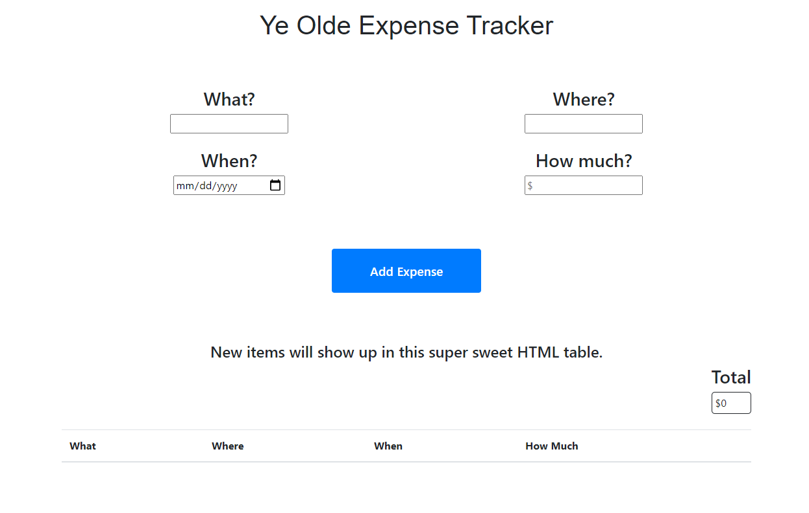

# JavaScript Expense Tracker
 
 ###  A simple app to keep track of your expenses and the overall total.
 
#### Play it here [here](https://trevorton27.github.io/expense-tracker/)
 
 
 
## Instructions
1. Enter the expense information in the four fields provided and either click the "Add Expense" button or press "Enter".
2. If you want to delete an expense, click the red button with a white X.
 
## Summary
This app is built using HTML, CSS and Vanilla JavaScript and taught me a lot about working with forms and local storage.

## Author
Trevor Mearns - Full Stack Software Developer [LinkedIn](https://www.linkedin.com/in/trevor-mearns-8a042a56/) | [Personal Website](https://trevormearns.com/)
